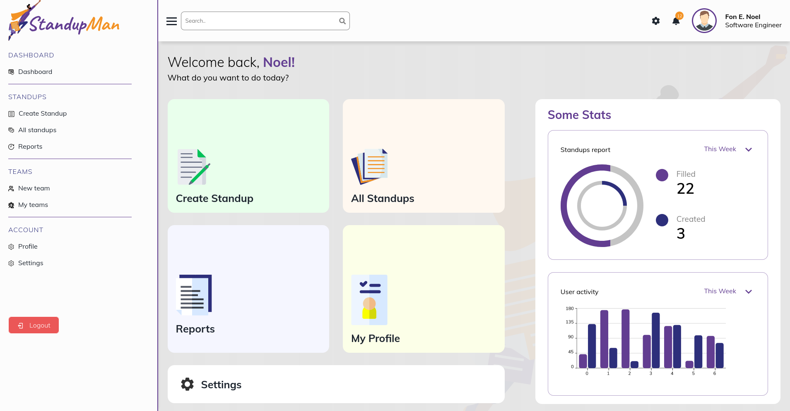

# <a href="https://standupman.xyz"><picture></picture></a>

**StandUpMan UI** is the web UI for [StandUpMan](github.com/standupman/standupman).

# Gallery

### Dashboard Landing

# Stack
StandUpMan UI is constructed using [svelte](#) and [svelte-kit](#).

## Svelte

For more information on `svelte` see [svelte documentation](https://svelte.dev/docs) & [svelte kit documentation](https://kit.svelte.dev/docs). 

For interactive tutorials on `svelte` see [svelte playground](https://svelte.dev/tutorial/basics).

# Installation 

- `git clone https://github.com/standupman/standupman-ui`
- `cd standupman-ui`
- `npm install`
- `npm run dev` 

# Contributors

Made with [contributors-img](https://contrib.rocks).

# License

Released under MIT License see [LICENSE](LICENSE.md)

